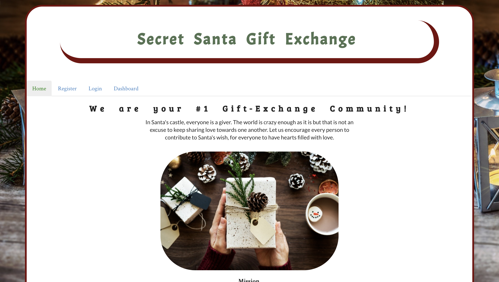

# Secret Santa Gift Exchange

## Description

A React-based application that encourage the holiday spirit among strangers and build a community of givers. As the user registers as a giver, they build their own profile which will then be used to inform whoever they will be matched with about their interests and personality to assist when purchasing a gift. The application utilizes 2 main tools: the Axios package for scraping information from the IBM Watson API and the Router function to connect pages and components for a seamless experience. 

It took the group a total of 3 weeks to complete the project where we initially built a road map for user flow and narrowed down the main functionality of the application. The next step is to delegate the tasks to start somewhere and as the days go by, there are a lot of collaboration among members to enhance routing, file structure, and user interface. 

## Technologies Used

Node- for Server Environment
Express-for web framework 
MongoDB/Mongoose for the Model
React- for front-end UI
CSS	- for Wrapper, Informed, Semantic-UI  & Material-UI components
Bcrypt- password hashing npm package 

## Group Members

<a href = "https://github.com/BethGmariam"> Beth </a>: project MVC setup, working on model, react-component for login, setting up mLab for MongoDB hosting
<a href = "https://github.com/chrissythebuilder"> Chriscelle </a>: front-end Responsive UI/UX, CSS, Semantic UI, React-components, User confirmation page modal
<a href = "https://github.com/MelvynLing"> Mel </a>: Watson-Personality-Insight API, user matching-logic, registration form using Informed-UI
<a href = "https://github.com/fnyah"> Zack </a>: User Authentication for user login/registration, user routes, database connection and hashing user’s personal info such as password

## Additional Instructions

pending for Heroku deployment; while waiting, to run the application please follow the instruction below:

- clone the repo to your local master
- "npm install" to get all required packages for best utilization of app functionality
- "npm run start" to compile the files and run our application 
- go to your browser and type localhost:5000

There are two independent package.json files:
1. one inside client folder for react (front end) only.
2. on main folder the main package.json where we add all required modules for server side.

Note: when installing modules make sure we add the modules in the proper package.json.

run "npm install" to install all npm modules required in the main package.json.

run "npm run client-install" to install all modules required for the client package.json; this is still while we are in the main project folder. No need to go to client folder and run npm install but can be done that way as well.

"npm run client" will run the client folder which is react-express-app (this avoids going back and forth to src folder and run yarn start)

"npm run server" will run server.js from the main folder.

"npm run dev" will run both client and server because we installed concurrently in the main package.json.

"nodemon run server" will run server.js and refreshes page; we do not have to stop server and run again everytime there is change nodemon will do that for us. 

